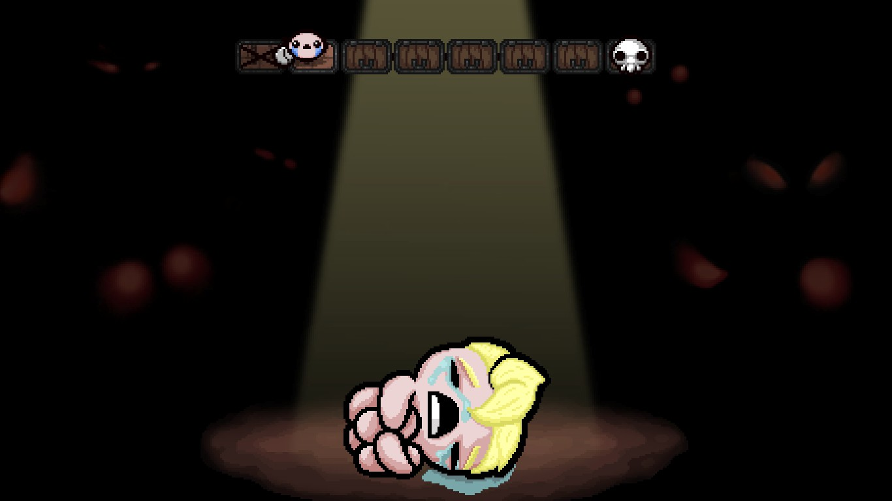

# Binding of Isaac mod: Cirrus
## FFVII-inspired mod for The Binding of Isaac: Afterbirth+

This repository contains the code and images used for my Binding of Isaac mod "Cirrus" ([Steam workshop link](https://steamcommunity.com/sharedfiles/filedetails/?id=853687740)), a parodic character based off Final Fantasy VII's protagonist Cloud Strife. Some helper batch files and Python scripts used for publishing and testing the mod have been ommited, as well as the Photoshop files and reference images.

  
  
  

> Play as Cirrus, a Final Fantasy-inspired character that levels up as he kills hordes of enemies, and try the might of the Busted Sword or the magic fireballs of Materia.
>
> New playable character: Cirrus
>
> -- Level up as you kill enemies! You start with low stats, but they grow with each level.
>
> -- Starts with Busted Sword (active) and Materia (trinket) equipped.
>
>New collectible: Busted Sword
>
> -- Kill 'em all! Necronomicon-style 4-room active item, but it scales with your damage.
>
> -- Starts soft, gets stronger as you level up and get damage upgrades.
>
> New trinket: Materia
>
> -- Randomly changes tears to fireballs (fire mind + burning effect). Scales with luck.
>
> -- You'll get more and more of them as you level up.
